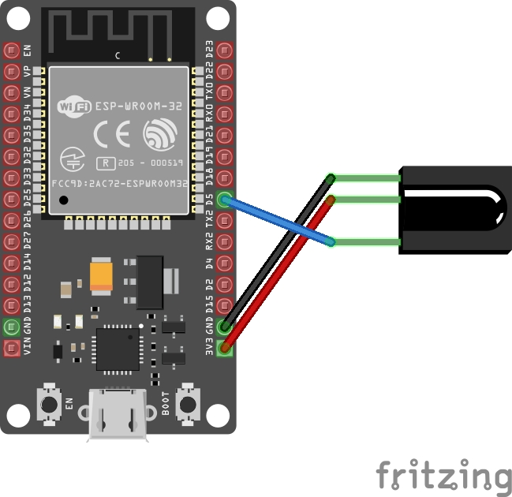
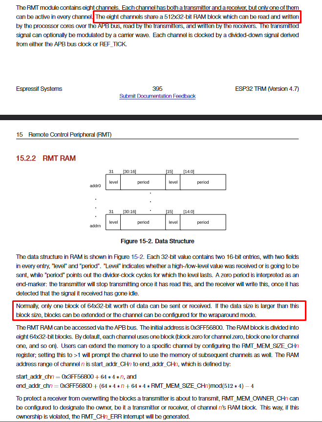
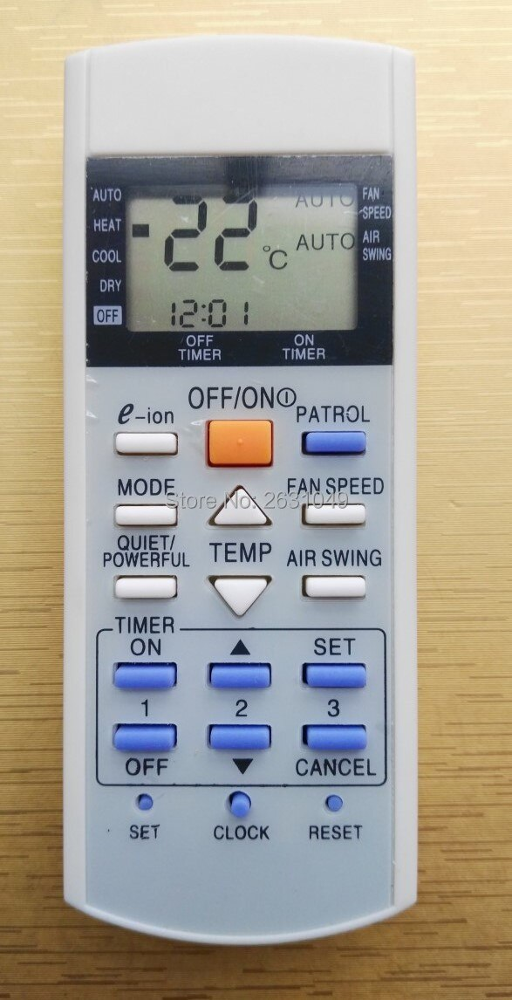
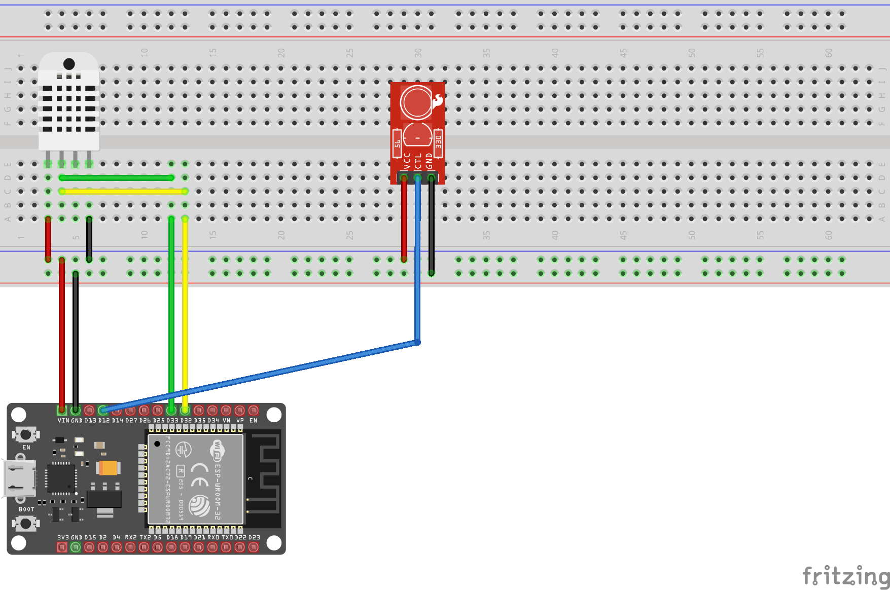

## Why

My room's AC unit (Panasonic) is quite old. It does a great job cooling/heating the place after all these years, but also lacks any "smart" capabilities found on modern units.

Personally, I am not a fan of making everything at my home internet-connected for reasons I won't delve into now, and I certainly don't want my AC unit to be internet-connected either. However, *I want to be able to expand on its functionality as needed*.

The unit has a basic set of features:

- Set mode (Cool, Heat, Dry, etc...)
- Set temperature
- Swing
- Fan speed
- ON/OFF Timer

Using the timer functionality, I can set a time for it to switch itself ON and another time for it to switch OFF. This is helpful, but is quiet limited as it only accepts time as a trigger and doesn't allow specifying a temperature/mode other than the one it was set to before the On/Off timer is set.

I'd like it to work based on the room temperature instead.
In winter, it should turn on in HEAT mode when the room temperature drops below a specified threshold and off when it goes above another threshold. In summer, it should turn on when the temperature is above a certain threshold and off when it gets below another threshold.

Yes, it has a thermostat but it is not very good. In summer, it makes the room too cold and in winter, it gets too hot. I suspect that if there was a temperature sensor at the other end of the room, it would help.

Additionally, Australian weather can be very humid. The AC unit has a "Dry" mode which activates its built-in dehumidifier but there is no built-in way to activate it based on air humidity levels.

Being a programmer, naturally I thought I could build something to automate the functions of the AC unit based on temperature and humidity parameters. And while I am at it, I could have it report the state to the isolated HomeAssistant instance on my network.

So to summarize, the goals of this project are:

- Turn the AC unit on/off and set mode & temperature based on room temperature.
- Turn the AC unit on/off and enable the dehumidifier when humidity goes above a set threshold.
- Nice to have: Report the AC unit status to the internal HomeAssistant instance on my network.

This post is about my journey to achieve this and all the problems/hurdles I ran into. Spoiler: I actually did it at the end.

## How

After I had the goals of the project defined, I started thinking about how I could achieve that. The first problem I had to solve was:

### Communication

Like I mentioned above, the AC unit is old and has no smart features or APIs I could hook into. I didn't want to solder wires into a PCB deep into its guts. I wanted this solution to be completely unobtrusive.

That left me with the remote control and infrared (IR) channel as the communication interface. My thinking was that if I could somehow capture a signal from the remote, I could then replay it at the AC unit.

In theory, I could capture an "ON" signal, an "OFF" signal, a "COOL/HEAT" signal, and, somehow, a signal for temperature control. At this point, I only knew how remote controls worked at a high level (Remote has IR LED, IR LED sends signal, IR Receiver receives signal and device does something). I soon learned there is a lot more to IR communication than just that. A lot more.

For now, the solution was to *somehow* send commands through the IR channel.


The next thing I had to figure was probably the easiest in this project:

### Sensing temperature & humidity

[In my previous post](https://blog.mrcsharp.com.au/post/using-dht22-with-nanoframework/), I used the DHT22 sensor to get the room temperature and humidity level.

DHT22 is simple to use, requires 3-5V power, and provides the measurements using a digital signal on a single pin. Perfect for use with a Micro-Controller Unit.

Ok, so I know what to use to get the temp & humidity. How can I talk to the DHT22 module?

### Tech stack

I am a .Net dev. I love .Net. So [nanoFramework](https://www.nanoframework.net/) is my choice for this task. Keep in mind that there are other projects to bring C# & .Net to the micro-controller world such as [Meadow](https://www.wildernesslabs.co/) & TinyCLR via [GHI](https://www.ghielectronics.com/) but I don't have much experience with them at this time.

I have been playing around with nanoFramework for a while now and I absolutely love it. It is an amazing feeling to see C# running on low powered MCUs such as ESP32. It integrates beautifully with Visual Studio and its debugger which means I can easily place breakpoints in my code and inspect and change variable values at runtime. This trumps Arduino IDE and makes debugging so much easier.

### MCU

ESP32 is a very good choice for this project. It has support for IR communication using its built-in RMT module. It is also compatible with nanoFramework making it ideal for what I am doing here.


## The Journey

The first thing I needed to do was to build something that can capture signals from the AC remote control and store them somehow for further analysis and replay.

ESP32 has an RMT (Remote Control Transceiver) module and the folks on nanoFramework's lively [discord server](https://discord.gg/gCyBu8T) pointed me towards a nanoFramework library that exposes the RMT hardware to the managed C# code. The library can be found [here](https://www.nuget.org/packages/nanoFramework.Hardware.Esp32.Rmt/).

I wired up an IR Receiver to my ESP32 dev board as follows:



With that in place, the next step is to write some code to capture incoming signals from the AC remote. nanoFramework has a sample project showing how the RMT nuget library can be used. Based on that sample, I wrote something like this:

```csharp

var rxChannel = new ReceiverChannel(RxPinNumber);
rxChannel.ClockDivider = 80; // 1us clock ( 80Mhz / 80 ) = 1Mhz
rxChannel.EnableFilter(true, 100); // filter out 100Us / noise 
rxChannel.SetIdleThresold(40000);  // 40ms based on 1us clock
rxChannel.ReceiveTimeout = new TimeSpan(0, 0, 0, 0, 60); 

rxChannel.Start(true);

while (true)
{
	var recivedSignal = rxChannel.GetAllItems();

	Debug.WriteLine($"Received a signal with {receivedSingal.Length} items:");

	foreach (var pulse in receivedSignal)
	{
		Debug.WriteLine($"Pulse: {pulse.Level0} {pulse.Duration0} - {pulse.Level1} {pulse.Duration1}");
	}
	
	Thread.Sleep(1000);
}

```

What this does is it initializes a new RMT Receiver Channel and sets some reasonable defaults as per the comments. Then it enters an infinite loop to listen for incoming infrared signals.

ESP32 RMT module has a simple way of representing the signal. You can read about it in details [here](https://docs.espressif.com/projects/esp-idf/en/v4.3.5/esp32/api-reference/peripherals/rmt.html). The main thing to know is that a signal is made of a collection of RMT Items. Each item represents a single "pulse" and is made of 2 pairs of values. Each pair consists of the duration in ticks and the signal level (HIGH vs. LOW).

The above code should've outputted something like:

```
Received a signal with 64 items:
Pulse: true 500 - false 1000
Pulse: true 250 - false 500
etc...
```

And here, I ran into the first set of issues:

- There was a lot of random, 1-item signals being picked up. (Interferance?)
- The remote signal seemed to have a variable length. Sometimes it would be 48 pulses long, sometimes only 35 (and other "random" numbers) even for the same button press.

I wasn't sure why I was getting a lot of 1-pulse signals in my output window. Increasing the `EnableFilter` duration parameter improved things but it still let some 1-pulse signals through frequently.

Doing some research helped me learn that there is usually a lot of infrared interference around us. Sunlight is a big source but there are others. It is why **IR Signals are modulated**. Manufacturers typically use a 38KHz carrier wave but it can range from 36KHz to 46KHz.

This didn't explain why I was seeing those short signals. My theory at this point was noise from the circuit and I opted to write some basic code to filter out such signals. After all, this was a temporary device put together just to record some signals for analysis and it was going to get disassembled afterwards. No reason to invest more time into this, right?

That solution worked and now I was left with the second problem: Is my AC unit remote really sending variable length signals for the same button presses? This made absolutely no sense and it took a while to get this sorted out.

### Variable length signal? No way!

There are various IR protocols out there. Each manufacturer usually uses one of them for their products. These protocols define some signal characteristics including but not limited to:

- Signal carrier frequency
- Header pulse length
- Logical 0 and 1 pulse length
- If the signal should repeat and how

It is up to the manufacturer to define what data to transmit. Some simple remote controls such as TV remotes could have a specific command for every button, while other remotes (like my AC unit's one) send out the entire state of the remote on every button press. More on that later.

For example, the most popular IR protocol is NEC. This protocols specifies that a signal:

- consists of 8 bit address & 8 bit command
- uses pulse distance modulation to represent digital data
- has a carrier frequency of 38kHz
- pulse is always 560 s

Logical 1 & 0 are represented as follows:


(Source: [NEC Protocol](https://www.sbprojects.net/knowledge/ir/nec.php))

But what about my AC Unit's remote control? Is it actually sending variable length signals even for the same button?

Well, no. According to some arduino IR libraries, Panasonic AC remotes send 216 bits of data. This is not even close to what I was getting above. This led me to believe that there was a problem with my setup: either hardware or software.

In terms of hardware, there wasn't much going on. An IR receiver connected directly to the MCU. So I decided to turn my attention to the software side of things.

My theory as to why I was seeing a variable number of pulses was due to some timing issues. I played around with `SetIdleThreshold` and found that setting it to `12000` ticks worked best. This is equal to waiting for 12ms for edges. If none are detected, then the RMT module would stop listening for more signals and return what it had already detected.

This change gave me a stable number of pulses. At this point, I was constantly getting 64 pulses on every button press.

But 64 != 216 bits. So what is going on here?

#### nanoFramework's relationship with ESP IDF

nanoFramework integrates with the ESP IDF framework. This integrations allows nanoFramework to communicate with the various hardware functions that ESP32 MCUs offer (GPIO, RMT, I2C, Wifi, Bluetooth, etc...).

ESP IDF methods are then exposed by nanoFramework and made available to the C# managed code. Libraries such as the nanoFramework ESP32 RMT one make use of these native methods.

This fact led me to consult with the ESP IDF documentation where I found this:



And more clearly, on the web version:


What this means is that ESP allocates 8 blocks of 64x32bit of internal RAM shared by the 8 RMT channels. Each channel gets 1 block (64x32bits).

This perfectly explained why I was now constantly getting 64 pulses.

Luckily, the docs mention that the number of allocated blocks to a channel can be increased using:

```c
esp_err_t rmt_set_mem_block_num(rmt_channel_t channel, uint8_t rmt_mem_num)
```

This is great! I went looking for an equivalent in nanoFramework's RMT library but sadly, it was not implemented.

nanoFramework's RMT implementation exposed only some of the capabilities of the ESP RMT module and it lacked many options already available in ESP IDF. This was an opportunity for me to contribute an improvement to the nanoFramework project!

Initially, I thought about adding support only for the method mention above. This would've been a quick contribution and would get me back to working on my project sooner. But it didn't feel right and the more I looked at the implementation the more I leaned towards a simple API refactor and exposing ***ALL*** the RMT configs.

#### Updating the nanoFramework RMT library

As mentioned earler, the nf library relies on native ESP IDF methods exposed by nf. This meant that any changes and improvements I make to the RMT library would first start in the nanoFramework firmware itself.

The nanoFramework discord is pretty amazing. I had a thread running with a few people (Including the founders of nf) discussing questions I had and how to approach this improvement/refactor. I made it clear that I had no experience with C/C++ code but I was keen on doing what is needed to fix the issue at hand. I was pointed towards the [nanoFramework dev container approach](https://docs.nanoframework.net/content/building/using-dev-container.html) which makes use of the dev containers feature in Visual Studio Code to setup a fully functional nf development environment within Docker.

It didn't take much effort to get that setup and I started diving into the codebase and making changes to the RMT implementation.

The result of the refactoring and improvement work was:

On the native side (nanoFramework Firmware) most of the changes were about introducing new C methods exposing RMT configs. Additionally, some changes were to add C#/Managed code-compatible types as needed.

On the managed side (nanoFramework RMT nuget library), the changes were as follows:

- Introduce a new `RmtChannelSetting` containing various config options for RMT channels. This is an abstract class with 2 classes inheriting from it:
	- `ReceiverChannelSettings` for receiver-specific channel configs.
	- `TransmitterChannelSettings` for transmitter-specific channel configs.
- Expose all ESP IDF RMT Configs through the various `*ChannelSetting` classes.
- Introduce a new `RmtChannel` abstract class exposing common functionality and properties used by receiver and transmitter channels. It has 2 inheritors:
	- `TransmitterChannel`
	- `ReceiverChannel`

These changes meant bumping the library version number from 1.x to 2.x as it introduced breaking changes. However, migrating to the new APIs was very straightforward. We have the following code snippit on the RMT library which shows how easy it is:

V1.x API Surface:
```csharp

// creating a transmit channel
var txChannel = new TransmitterChannel(TxPinNumber);
txChannel.ClockDivider = 80;
txChannel.CarrierEnabled = false;
txChannel.IdleLevel = false;
txChannel.AddCommand(new RmtCommand(20, true, 15, false));
// add more commands...

txChannel.Send(false);

// creating a receive channel
var rxChannel = new ReceiverChannel(RxPinNumber);
rxChannel.ClockDivider = 80; // 1us clock ( 80Mhz / 80 ) = 1Mhz
rxChannel.EnableFilter(true, 100); // filter out 100Us / noise 
rxChannel.SetIdleThresold(40000);  // 40ms based on 1us clock
rxChannel.ReceiveTimeout = new TimeSpan(0, 0, 0, 0, 60); 
rxChannel.Start(true);
```

In V2.x the above must be re-written as:

```csharp
var txChannelSettings = new TransmitChannelSettings(-1, TxChannelPinNumber)
{
  ClockDivider = 80,
  EnableCarrierWave = false,
  IdleLevel = false
};

var txChannel = new TransmitterChannel(txChannelSettings);
txChannel.AddCommand(new RmtCommand(20, true, 15, false));
// add more commands...

txChannel.Send(false);


var rxChannelSettings = new ReceiverChannelSettings(pinNumber: RxChannelPinNumber)
{
  EnableFilter = true,
  FilterThreshold = 100,
  IdleThreshold = 40_000,
  ReceiveTimeout = new TimeSpan(0, 0, 0, 0, 60)
};

using var rxChannel = new ReceiverChannel(rxChannelSettings);
rxChannel.Start(clearBuffer: true);
```

As you can see, the big change is around declaring the channel configs in a separate class and passing that instance as a parameter to the channel object constructor.

Some of the new configurations that were added to the library as part of this were:
- `NumberOfMemoryBlocks`: set the number of memory blocks that a channel can own. ***This is what I needed***.
- `EnableDemodulation`: enable/disable signal de/modulation.
- `CarrierWaveFrequency`: set the carrier wave frequency used in modulating/demodulating the IR signal.
- `CarrierWaveDutyPercentage`
- `EnableLooping`: allows to repeat the signal sent
- `LoopCount`
- `EnableSignalInverter` enables/disables a built-in ESP32 features that inverts the signal using hardware.

Once these pull requests were merged in, I was back working on my AC automation project.

### Decoding the Panasonic AC Unit Remote Signal

Through work done by other people in the open source community (referenced at the end) I learned that AC unit remote controls generally transmit the entire state of AC unit that is stored in the remote control.

This is generally true for AC remotes that have an LCD such as this one:


What this meant is that my plan to simply record a signal from button press and play it back would not work. I need to set the mode & temperature at the same time and in order to do that, I have to replicate the state of a remote control in my code, manipulate it to set the parameters as I need and then transmit that state data via IR.

The plan has now shifted towards decoding the remote control signal rather than simply replaying it.

Luckily, I didn't have to start from scratch. The same work I referenced above proved to be a great starting point. It listed out some important facts about the contents of the signal and some details that saved me a lot of time.

The signal is made of 2 frames of data:

- Frame 1:
	- 8 bytes long.
	- Constant value equal to `0x4004072000000060`.
	- Sent in MSB order.
- Frame 2: 
	- 18 bytes long.
	- Transmitted as LSB8 (more info on this later).
	- First 5 bytes are equivalent to bytes from Frame 1 but in LSB8.
	- The remaining bytes transmit the state of the remote.
- CRC:
	- Calculated by adding all 18 bytes of Frame 2.
	- Transmitted as LSB8.
	- Last byte in the transmission.

In order to transmit data on this Panasonic Protocol, the follow timings must be adhered to:
| Type             | Time (micro-second, approx.) |
| ---------------- | ---------------------------- |
| ---------------- | ---------------------------- |
| Header           | 3500                         |
| Header Space     | 1750                         |
| Pulse            | 435                          |
| 'Zero' Bit Space | 435                          |
| 'One' Bit Space  | 1300                         |
| Modulation       | 38Khz                        |
| Tolerance        | Max. 30%                     |
|                  |                              |

With this info, I only had to focus on the second frame of the signal.

I started this by writing an "IR Decoder" program that is deployed to my ESP32 that I connected to an IR receiver (as per the fritzing diagram above).

The complete utility program can be found on github [here](https://github.com/MrCSharp22/nanoframework-esp32-panasonic-ir-decoder). Deploying it to the ESP32 dev board results in the following when a signal is received from the remote control:

```
Frame 1:
=== RAW === | === HEX ===
 0100 0000  |     0x40
 0000 0100  |     0x04
 0000 0111  |     0x07
 0010 0000  |     0x20
 0000 0000  |     0x00
 0000 0000  |     0x00
 0000 0000  |     0x00
 0110 0000  |     0x60
Frame 2:
=== RAW === | === HEX === | === LSB8 === | === MSB HEX ===
 0100 0000  |     0x40    | 0000 0010  |    0x02
 0000 0100  |     0x04    | 0010 0000  |    0x20
 0000 0111  |     0x07    | 1110 0000  |    0xE0
 0010 0000  |     0x20    | 0000 0100  |    0x04
 0000 0000  |     0x00    | 0000 0000  |    0x00
 0001 1100  |     0x1C    | 0011 1000  |    0x38
 0000 0100  |     0x04    | 0010 0000  |    0x20
 0000 0001  |     0x01    | 1000 0000  |    0x80
 1000 1100  |     0x8C    | 0011 0001  |    0x31
 0000 0000  |     0x00    | 0000 0000  |    0x00
 0000 0000  |     0x00    | 0000 0000  |    0x00
 0111 0000  |     0x70    | 0000 1110  |    0x0E
 0000 0111  |     0x07    | 1110 0000  |    0xE0
 0000 0000  |     0x00    | 0000 0000  |    0x00
 0000 0000  |     0x00    | 0000 0000  |    0x00
 1000 0001  |     0x81    | 1000 0001  |    0x81
 0000 0000  |     0x00    | 0000 0000  |    0x00
 0000 0000  |     0x00    | 0000 0000  |    0x00
 0111 1110  |     0x7E    | 0111 1110  |    0x7E      <<< CRC
```

Having the signal output formatted like this was very important. I was then able to use [WinMerge](https://winmerge.org/) I could easily see which bits flipped with each button press and how the state was being represented.

For example, this shows the difference between sending an OFF command (LEFT) vs. sending an ON command (RIGHT):


You can see how bit 0 in byte 13 indicates what state (ON or OFF) the AC should be on: 0 == OFF, 1 == ON.

I used this appraoch for the other buttons and functions on the remote and my results matched what I had seen in other resources online. Here's the breakdown of all the commands and their representation in the data frame:

| Byte #  | Function                      | Description / Notes                                                           |
| ------- | ----------------------------- | ----------------------------------------------------------------------------- |
| 0       | Static                        | First 8 bytes are always the same                                             |
| 1       | Static                        | This is the device/manufacturer ID                                            |
| 2       | Static                        | Always equal to `0x4004072000000060`                                          |
| 3       | Static                        |                                                                               |
| 4       | Static                        |                                                                               |
| 5       | Static                        |                                                                               |
| 6       | Static                        |                                                                               |
| 7       | Static                        |                                                                               |
| FRAME 2 | ====================          | ====================================                                          |
| 8       | Static                        | The first 5 bytes in frame 2 always                                           |
| 9       | Static                        | match the first 4 bytes from frame 1                                          |
| 10      | Static                        | and equal to 0x4004072000 but in the LSB8 format                              |
| 11      | Static                        |                                                                               |
| 12      | Static                        |                                                                               |
| 13      | Mode, On/Off Switch and Timer | Bit 0 is On/Off (1/0). Bits 4..7 are mode. Bit 3 is special. More info below. |
| 14      | Temperature                   | Divide by 2 to get actual temp in C.                                          |
| 15      | Unknown                       | 0x80                                                                          |
| 16      | Swing & Fan                   | The 4 MSB bits = FAN / 4 LSB bits = Swing. Refer to table below for codes     |
| 17      | Unknown                       | 0x00                                                                          |
| 18      | Timer (ON)                    | Starting value: 0x00                                                          |
| 19      | Timer (ON/OFF)                | Starting value: 0x08                                                          |
| 20      | Timer (OFF)                   | Starting value: 0x80                                                          |
| 21      | Profile                       | Refer to profile table for info (WIP/Not 100% correct)                        |
| 22      | Unknown                       | 0x00                                                                          |
| 23      | Model (Potentially)           | 0x80 (Static?)                                                                |
| 24      | Time (Part 1)                 | The value in this part is equal to the time in minutes. Max 255 minutes.      |
| 25      | Time (Part 2)                 | The value in this part is how many 256 minutes are in the current time.       |
| 26      | CRC                           | Calculated by adding all the bytes in frame 2.                                |

##### On/Off, Mode, and Timer Function

Byte #13

This byte packs a lot of info:

- Bit #0: On/Off command. 0 = Turn off AC unit. 1 = Turn on AC unit.
- Bit #1: Timer option. 1 = Enable ON Timer option.
- Bit #2: Timer option. 1 = Enable Off Timer option.
- Bit #3: Execute command. 1 = AC unit will execute the command immediately. 0 = AC unit will receive the command but will not execute it.
- Bit #4 to #7 indicates the operation mode as per below table:

| Bit Mask | Mode |
| -------- | ---- |
| 0110     | FAN  |
| 0010     | DRY  |
| 0011     | COOL |
| 0100     | HEAT |
| 0000     | AUTO |


##### Swing & Fan

Byte #16. The possible values as per the below tables:

###### Swing
4 LSB bits on Byte #16
| Bit Mask | Meaning                |
| -------- | ---------------------- |
| 1111     | AUTO                   |
| 0001     | Horizontal (1)         |
| 0010     | 2                      |
| 0011     | 3                      |
| 0100     | 4                      |
| 0101     | Vertical or Ground (5) | 

###### Fan
4 MSB bits on Byte #16
| Bit Mask | Meaning     |
| -------- | ----------- |
| 1010     | AUTO        |
| 0011     | Slowest (1) |
| 0100     | 2           |
| 0101     | 3           |
| 0110     | 4           |
| 0111     | Fastest (5) | 


##### Current Time

The time is represented in number of minutes since midnight (00:00) by 2 bytes: #24 & #25.

Byte #24 represents the minutes since midnight. But, because the max value of a byte is 255, byte #24 can't go higher than that and so byte #25 will increment by 1 each time we reach the limit in byte #24.

So to read the time, do this:

- Read byte #25.
- Multiply its value by `256` (255 = 0xFF in byte #24 but when the value is 256, byte #24 becomes 0x00 and byte #25 becomes 0x01).
- Read byte #24.
- Add the 2 values.
- Use `TimeSpan` (from the .Net BCL) to get the time in hour:minute format.

Examples:

Time is 00:02
| byte | value |
| ---- | ----- |
| 24   | 0x02  |
| 25   | 0x00  |

Time is 04:43
| byte | value |
| ---- | ----- |
| 24   | 0x1B  |
| 25   | 0x01  |

##### Timer

###### On/Off Timer

To enable/disable, set bit #1 in byte #13 to 1 (ON)/0 (OFF). This is for ON Timer. Off timer is the same but the state is stored in bit #2.

Time is stored in byte #18, #19, and #20 (Yes, this took a while to figure out) in simiar fashion as how Current Time is represented:

- Byte #18 is number of minutes in increments of 10 (0x10, 0x14, etc...) and used for the ON timer.
- Byte #19 is made of 2 parts:
	- The lower 4 bits increment by one when byte #18 overflows. Each increment equals 256 minutes.
	- The upper 4 bits represent the continuation of the Off timer value from byte #20.
	- The starting value of byte #19 is 0x08.
- Byte #20 is made of 2 parts as well:
	- The lower 4 bits are basically the upper 4 bits of the minutes (upper 4 bits of byte #19). You take these lower 4 bits then put the upper 4 bits next to it to get the value. This is for the OFF timer. 
		- Example: (Byte #20 lower 4 bits) (Byte #19 upper 4 bits)
	- When minutes go beyond 256, the upper 4 bits increment by 1. 
	- The starting value of byte #20 is 0x80.

Examples:

ON Timer: 00:00
OFF Timer: 00:00
| Byte | Value |
| ---- | ----- |
| 18   | 0x00  |
| 19   | 0x08  |
| 20   | 0x80  |

ON Timer: 05:00
OFF Timer: 04:20
| Byte | Value | Explanation                                                                                                                                                         |
| ---- | ----- | ------------------------------------------------------------------------------------------------------------------------------------------------------------------- |
| 18   | 0x2C  | 0x2C = 44. So 44 Minutes on ON Timer                                                                                                                                |
| 19   | 0x49  | Starting value is 0x08. Ignore the upper 4 bits and value would be 0x09. 0x09 - 0x08 = 0x01 = 256 minutes. Add this to minutes from byte #18 and you have ON Timer. | 
| 20   | 0x90  | 0x90 - 0x80 = 0x10. Take the result and append the upper 4 bits of byte 18 to get the off time in minutes. So 0x104 = 260 (4hrs and 20 minutes)                                                         |

Programmer Guidance:

For byte #19, to get the upper 4 bits, right shift by 4:

```csharp
var upper4Bits = 0x49 >> 4; // result: 0x04
```

To get the lower 4 bits, you can isolate them using an & operator:

```csharp
var lower4Bits = 0x49 & 0xF; // result: 0x09

// this is equal to writing it like: 0b_0100_1001 & 0b_0000_1111
```


##### Temp

Read byte #15 as `int8` (`byte` in C#) and divide by 2 to get temp in Celsius.


##### Profiles

This is a work in progress as I don't know how the remote is structuring the data when a profile key is pressed. This is not important for my project so I haven't spent much time on it yet.
| Bit Mask  | Profile |
| --------- | ------- |
| 0001 0000 | Normal  |
| 0001 0001 | Boost   |
| 0011 0000 | Quiet   | 


##### LSB8 vs MSB vs LSB Tranformation

Here's an example showing the difference between LSB and LSB8 when encoding data:

**MSB**: 01 02 03 (0000 0001 0000 0010 0000 0011)
**LSB**: C0 40 80 (1100 0000 0100 0000 1000 0000)
**LSB8**: 80 40 C0 (1000 0000 0100 0000 1100 0000)


##### Clean and Valid Starting State

The following byte array has a valid starting remote state that can be transmitted as is. I used this to observe the AC unit acknoledging the command properly.

```csharp
public static byte[] StartingData = new byte[]
{
    0x40, 0x04, 0x07, 0x20, 0x00, 0x00, 0x00, 0x60,
    0x02, 0x20, 0xE0, 0x04, 0x00, 0x38, 0x20, 0x80,
    0x31, 0x00, 0x00, 0x0E, 0xE0, 0x00, 0x00, 0x81,
    0x00, 0x00, 
    0x7E
};
```

##### CRC Calculation

Here's how to calculate the CRC:

```csharp
private static byte CalcCrc(byte[] data, int start, int end)
{
	byte crc = 0x00;
	for (var i = start; i < end; i++)
	{
		crc += data[i];
	}

	return crc;
}
```


### Automating my AC Unit

With all that done, I was finally able to write some code to automate my AC unit using the IR signal. You can find the full source code [here](https://github.com). 

Here's how the ESP32 is wired up to the DHT22 and IR sender module:



As for the code, here's the important parts:

I started by defining the GPIO pins, the GPIO Controller, the DHT22 driver, and finally, the RMT channel I'll use:

```csharp

public static void Main()
{
	var dhtEchoPin = 33;
	var dhtTriggerPin = 32;
	var dhtWakePin = 26;
	var irWakePin = 15;
	var irSignalPin = 16;

	using var gpioController = new GpioController();
	using var statusLed = gpioController.OpenPin(statusLedPin, PinMode.Output);
	using var dhtWaker = gpioController.OpenPin(dhtWakePin, PinMode.Output);
	using var irWaker = gpioController.OpenPin(irWakePin, PinMode.Output);
	
	using var dhtSensor = new Dht22(dhtEchoPin, 
	                dhtTriggerPin, 
	                gpioController: gpioController);

	// wake the DHT22 now. This should give it enough time to "warm up"
	dhtWaker.Write(PinValue.High);

	// while the DHT is waking up, I connect the ESP32 to Wifi and to my MQTT instance on my network. This is used to send room temperature and humidity levels to my home assistant instance. Code omitted for brevity.

	var attemptNumber = 0;
	while (attemptNumber < 5)
	{
		var temp = dhtSensor.Temperature;
		var humidity = dhtSensor.Humidity;
		if (!dhtSensor.IsLastReadSuccessful)
		{
			// log error to serial output if enabled and then try again
			// logging code here
			Thread.Sleep(1000);
			attemptNumber++;
			continue;
		}

		// very basic automation implementation (WIP)
		if (temp.DegreesCelsius > 25)
        {
	        irWaker.Write(PinValue.High);
            PanasonicIRController.TurnOn(16, PanasonicACMode.Cool, irSignalPin);
            irWaker.Write(PinValue.Low);
        }
        else if (temp.DegreesCelsius < 20)
        {
            irWaker.Write(PinValue.High);
            PanasonicIRController.TurnOn(25, PanasonicACMode.Heat, irSignalPin);
            irWaker.Write(PinValue.Low);
        }
        else
        {
			irWaker.Write(PinValue.High);
            PanasonicIRController.TurnOff(irSignalPin);
            irWaker.Write(PinValue.Low);
        }
	}
}

// code continues by reporting temperature and then putting the ESP32 to sleep for 15 minutes.

```

The `PanasonicIRController` class contains all the code required to manipulate the clean starting state shown above and sending the signal via the RMT module:

```csharp
internal static class PanasonicIRController
    {
        private const ushort HeaderPulse = 3468;
        private const ushort HeaderSpace = 1767;
        private const ushort Pulse = 432;
        private const ushort ZeroSpace = 432;
        private const ushort OneSpace = 1296;
        private const ushort PauseSpace = 10000;

        private const int OnOffModeByteIndex = 13;
        private const int TempByteIndex = 14;
        private const int ProfileByteIndex = 21;

        private static RmtCommand Header = new RmtCommand(HeaderPulse, true, HeaderSpace, false);
        private static RmtCommand ZeroBit = new RmtCommand(Pulse, true, ZeroSpace, false);
        private static RmtCommand OneBit = new RmtCommand(Pulse, true, OneSpace, false);
        private static RmtCommand Pause = new RmtCommand(Pulse, true, PauseSpace, false);
        private static RmtCommand End = new RmtCommand(Pulse, true, 0, false);

        public static void TurnOn(byte temp, PanasonicACMode mode, int irChannelPinNumber)
        {
            var commandData = GetStartingCommandData();

            // set on flag
            commandData[OnOffModeByteIndex] |= 0x01;

            // set mode
            commandData[OnOffModeByteIndex] |= (byte)mode;

            //set temp
            commandData[TempByteIndex] = (byte)(temp * 2);

            SendIRCommand(irChannelPinNumber, commandData);
        }

        public static void TurnOff(int irChannelPinNumber)
        {
            var commandData = GetStartingCommandData(); // starting command data is by default OFF
            SendIRCommand(irChannelPinNumber, commandData);
        }

        private static TransmitChannelSettings GetTransmitChannelSettings(int irChannelPinNumber)
            => new(irChannelPinNumber)
            {
                ClockDivider = 80,

                EnableCarrierWave = true,
                CarrierLevel = true,
                CarrierWaveFrequency = 38_000,
                CarrierWaveDutyPercentage = 50,

                IdleLevel = false,
                EnableIdleLevelOutput = true,

                NumberOfMemoryBlocks = 4,
                SignalInverterEnabled = false,
            };

        private static byte[] GetStartingCommandData()
            => new byte[]
        {
            /*  Byte 0 - 7   */ 0x40, 0x04, 0x07, 0x20, 0x00, 0x00, 0x00, 0x60, // frame 1: static

            //  frame 2
            /*  Byte 8 - 12  */ 0x02, 0x20, 0xE0, 0x04, 0x00, // this is static
            
            /* Byte 13       */ 0x38, // On/Off + Mode
            /* Byte 14       */ 0x20, // Temperature
            /* Byte 15       */ 0x80,
            /* Byte 16       */ 0x31,
            /* Byte 17       */ 0x00,
            /* Byte 18       */ 0x00,
            /* Byte 19       */ 0x08,
            /* Byte 20       */ 0x80,
            /* Byte 21       */ 0x00, // Profile
            /* Byte 22       */ 0x00,
            /* Byte 23       */ 0x81,
            /* Byte 24       */ 0x00,
            /* Byte 25       */ 0x00,
            /* Byte 26       */ 0x7E // crc
        };

        private static void AddCommands(this TransmitterChannel txChannel, byte[] data, int start, int end)
        {
            for (var i = start; i %3C end; i++)
            {
                byte b = data[i];
                for (byte mask = 0x01; mask > 0x00 && mask < 0xFF; mask <<= 1)
                {
                    if ((b & mask) > 0)
                    {
                        txChannel.AddCommand(OneBit);
                    }
                    else
                    {
                        txChannel.AddCommand(ZeroBit);
                    }
                }
            }
        }

        private static byte CalcCrc(byte[] data, int start, int end)
        {
            byte crc = 0x00;
            for (var i = start; i < end; i++)
            {
                crc += data[i];
            }

            return crc;
        }

        private static void SendIRCommand(int irChannelPinNumber, byte[] commandData)
        {
            // setup an IR trasnmitter channel
            var irTxChannelSettings = GetTransmitChannelSettings(irChannelPinNumber);
            using var irTxChannel = new TransmitterChannel(irTxChannelSettings);
            irTxChannel.ClearCommands();

            // add command data to the tx channel buffer
            irTxChannel.AddCommand(Header);
            irTxChannel.AddCommands(commandData, 0, 8); // frame 1
            irTxChannel.AddCommand(Pause);
            irTxChannel.AddCommand(Header);
            irTxChannel.AddCommands(commandData, 8, commandData.Length - 1); // frame 2 without CRC

            // calculate the crc
            var crc = CalcCrc(commandData, 8, commandData.Length - 1);
            irTxChannel.AddCommands(new byte[] { crc }, 0, 1); // CRC
            irTxChannel.AddCommand(End);

            // finally, send the command
            irTxChannel.Send(waitTxDone: true);
        }
    }

    internal enum PanasonicACMode : byte
    {
        // bits already left shifted by 4 (<< 4)

        Auto = 0x00,

        Fan = 0x60,

        Dry = 0x20,

        Cool = 0x30,

        Heat = 0x40,
    }

    internal enum PanasonicACProfile : byte
    {
        Normal = 0x10,

        Boost = 0x11,

        Quiet = 0x30
    }
```


And with that, I now have a functioning device to automate my Panasonic AC unit. The automation "algorithm" isn't the most sophisticated there is but it is a great starting point as I go and add more scenarios to it.

If you have read this far, thank you. I hope you enjoyed the post and found it helpful.

Github repos:

- [nanoFramework Panasonic IR code sender](https://github.com/MrCSharp22/nanoframework-esp32-panasonic-ir-sender)
- [nanoFramework Panasonic IR decoder](https://github.com/MrCSharp22/nanoframework-esp32-panasonic-ir-decoder)

## References & Literature
- Some of this was confirmed by [this project](https://github.com/r45635/HVAC-IR-Control). It is for an different (older or newer) revision of the AC remote so there are some changes.
- [Panasonic AC Protocol Library](https://github1s.com/crankyoldgit/IRremoteESP8266/blob/HEAD/src/ir_Panasonic.h#L99-L101)
- [IR Protocols Database (by John S. Fine)](http://www.hifi-remote.com/johnsfine/DecodeIR.html)
- [Info-rich page about IR protocols](http://numericana.com/answer/ir.htm)
- [IR-Send library intro post](https://www.righto.com/2009/08/multi-protocol-infrared-remote-library.html)
- [IR Remote Control Theory](https://www.sbprojects.net/knowledge/ir/index.php)
